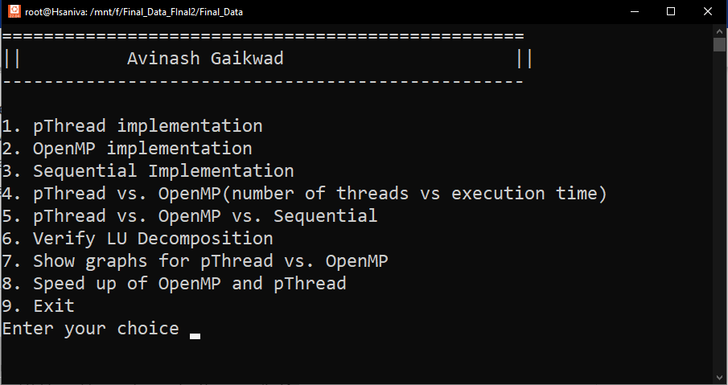
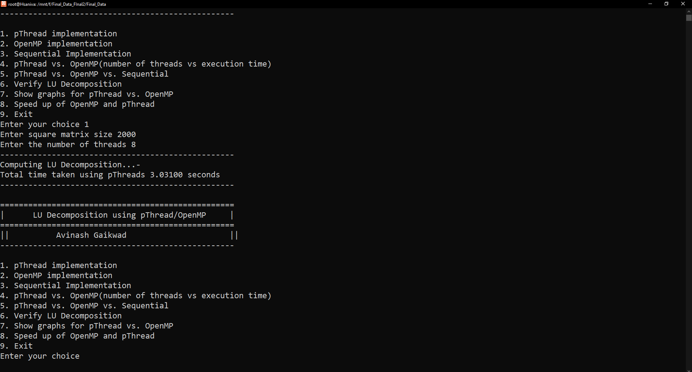
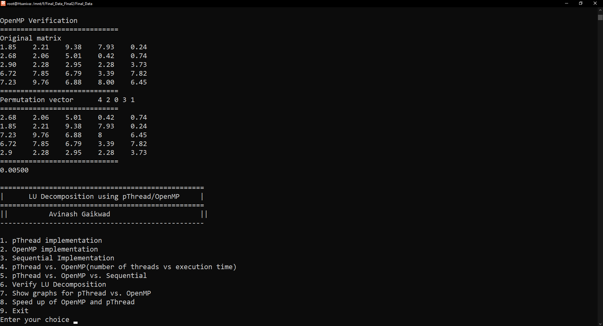
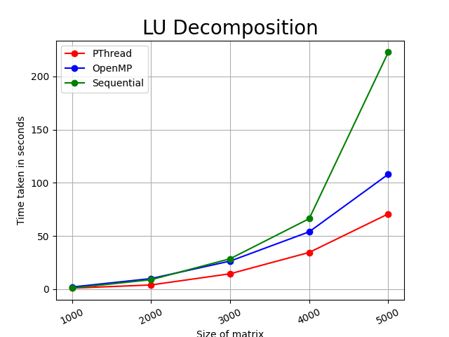
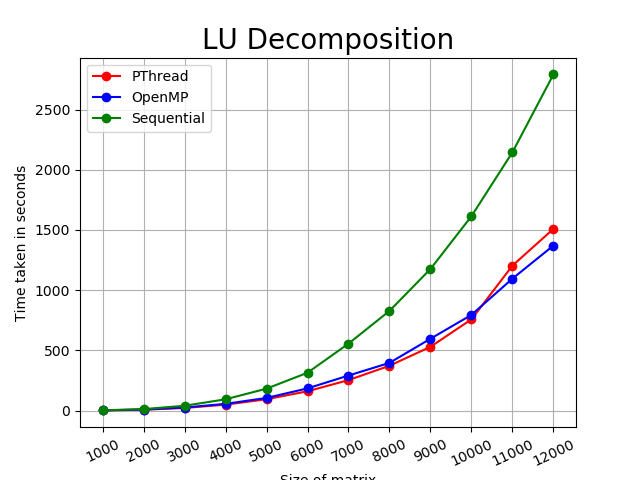
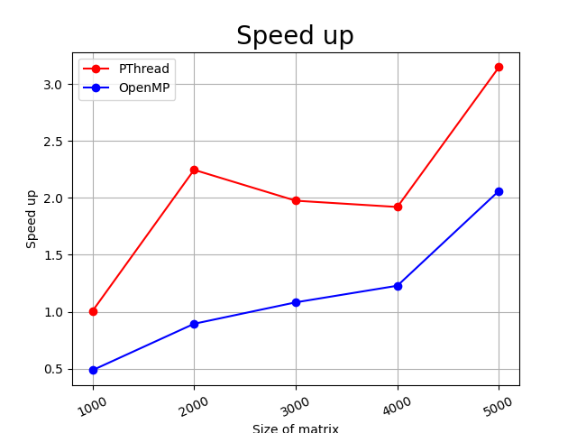
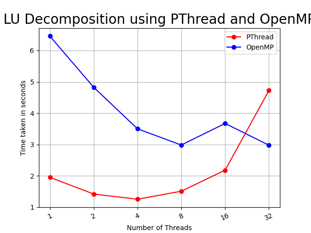
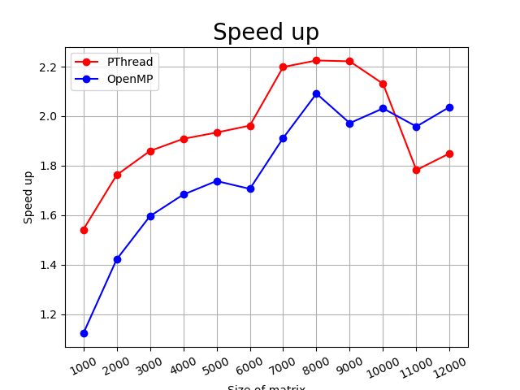

# Parallel LU decomposition
LU Decomposition (where 'LU' stands for 'lower upper') is a classical method for transforming an N x N matrix A into the product of a lower-triangular matrix L and an upper-triangular matrix U, A = LU.

## Table of Contents
1. [Prerequisites](#prerequisites)
2. [Usage](#usage)
3. [Screenshots](#screenshots)

### Prerequisites
***
Below are the libraries/tools required in order to run the program
* Linux based OS
* C++ compiler
* Python and other libraries like matplotlib, numpy etc.
* Make

## Usage
***
* make clean (For cleaning the project files such as object files, output files etc.
* make all (For compiling the program(s) and creating their respective executables.)
* ./start.sh (For executing the main program)

## Screenshots
Menu page

pThread implementation

LU decomposition verification

Graphical outputs

